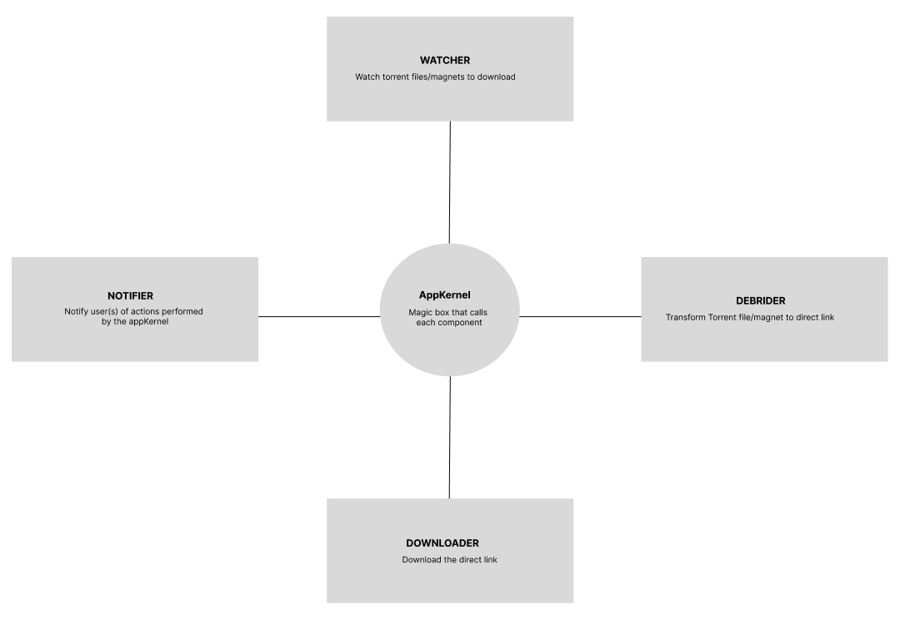

# Alldebrid watcher

[](https://ko-fi.com/V7V6HX49E)

Alldebrid-watcher is an open-source application that allows for automatic downloading of torrent files using AllDebrid services. The application is divided into 4 configurable services: Watcher, Debrider, Downloader, and Notifier.

> **Important Information**   
> If you are using a version older than 2.0.0, please refer to [the old documentation](https://github.com/vlacour97/alldebrid-watcher/tree/1.1.1)

## How the app works ?

The application is divided into 5 parts:
* **AppKernel**
* **Watchers**
* **Debrider(s)** (other debriders may come later)
* **Downloaders**
* **Notifiers**




### AppKernel

Enables the operation of the application by calling different services

### Watchers

Monitors torrent files or magnets to be downloaded.

Available Watchers:
* **FileSystem**: Monitors a folder and downloads a torrent as soon as a file is dropped.
* Coming soon

> Only one watcher can be used at a time

### Debriders

Transforms a torrent or magnet file into a direct link

Available Debriders:
* [**Alldebrid**](https://alldebrid.fr/)
* May come in the future

> Only one debrider can be used at a time

### Downloaders

Downloads a file transformed by the debrider

Available Downloaders:
* **FileSystem**: Uses node JS to download the file locally
* **QNAP Download Station**: Use unofficial API for QNAP Download Station

> Only one downloader can be used at a time


### Notifiers

Notifies the user of actions taken. It is possible to select which actions you want to be informed of.

Possible notification types:
* A torrent or magnet file was found
* A torrent or magnet file was debridled
* The download of a file has begun
* Download progress (x% downloaded)
* The download is finished
* The download encountered an error

Available Notifiers:
* **Stdout**: Log les action dans la sortie standard de la console
* **Pushover**: Sends notifications using the [Pushover](https://pushover.net/) service
* Coming soon

> **Multiple notifiers can be used at the same time**  
> Each notifier can inform of different actions (example: Stdout => verbose mode + Pushover => Downloads started, Downloads finished)

## Usage with Node JS

### Prerequisites

- A valid AllDebrid account with an [API key](https://alldebrid.fr/apikeys/)
- Node.js
- npm or yarn

### Installation

Clone the Github repository on your machine using the following command:

```bash
git clone https://github.com/vlacour97/alldebrid-watcher.git
```

Install the dependencies using npm or yarn:
``` bash
npm install ts-node -g
npm install 
```

or

``` bash
yarn install ts-node -g
yarn install 
```

### Launch

Each service can be configured independently using [environment variables](#Configuration)

#### Basic usage example

Launch the application using npm or yarn:

``` bash
ALLDEBRID_TOKEN=allbredid-token  TORRENT_FOLDER=path/to/torrents DOWNLOAD_FOLDER=path/to/downloads npm run start
```

or

``` bash
ALLDEBRID_TOKEN=allbredid-token  TORRENT_FOLDER=path/to/torrents DOWNLOAD_FOLDER=path/to/downloads yarn start
```

## Use with Docker

### Prerequisites

- A valid AllDebrid account with an [API key](https://alldebrid.fr/apikeys/)
- Docker

### Lancement

Each service can be configured independently using [environment variables](#Configuration)

#### Basic usage example

``` bash
docker run -v path/tot/torrent:/torrents -v path/to/download:/downloads -e ALLDEBRID_TOKEN=allbredid-token vlacour97/alldebrid-watcher
```

The options used in this command are:

-   `-e ALLDEBRID_TOKEN` : sets the environment variable for your AllDebrid token
-   `-v <path/to/torrents>:/app/torrents` : binds the local folder containing the torrent files to the folder in the container where the application will look for torrent files
-   `-v <path/to/downloads>:/app/downloads` : binds the local folder where downloaded files will be saved to the folder in the container where the application will save downloaded files


## Configuration

### Watcher

#### Filesystem

| Environment Variable | Required ? | Default value | Description |
| --- | --- | --- | --- |
| TORRENT_FOLDER | No | /torrents | Path to the folder containing the torrent files |

### Debrider

#### AllDebrid

| Environment Variable | Required ? | Default value | Description |
| --- | --- | --- | --- |
| ALLDEBRID_TOKEN | Yes |  | AllDebrid API key |
| AUTHORIZED_EXTENSIONS | No | null | List of authorized extensions for download separated by a comma (example: avi,mkv,..) |

### Downloader

| Environment Variable | Required ? | Default value | Available values | Description                    |
| --- | --- |---------------| --- |--------------------------------|
| DOWNLOADER_SERVICE | No | filesystem    | filesystem, qnap_download_station | Choice of the download service |


#### Filesystem

| Environment Variable | Required ? | Default value | Description |
| --- | --- | --- | --- |
| DOWNLOAD_FOLDER | No | /downloads | Path to the folder where the files are downloaded |
| MAX_PARALLELS_DOWNLOADS | No | 5 | Number of parallel downloads |

#### QNAP Download Station

| Environment Variable | Required ? | Default value | Description                                         |
|----------------------|------------|---------------|-----------------------------------------------------|
| QNAP_ENDPOINT        | Yes        |               | Url of QNAP server. eg: http://localhost:8080       |
| QNAP_USERNAME        | Yes         | admin         | Username of QNAP user                               |
| QNAP_PASSWORD        | Yes         |    password           | Password of QNAP user                               |
| TEMPORARY_FOLDER        | Yes         |               | Temporary folder use by download station            |
| DOWNLOAD_FOLDER        | Yes         |               | Download destination folder use by download station |

### Notifier

| Environment Variable | Required ? | Default value | Available values | Description |
| --- | --- | --- | --- | --- |
| NOTIFIER_SERVICES | No | stdout | stdout, pushover | Choice of notification services separated by a comma |
| NOTIFIER_SERVICES_CONFIG | No | {} | **Keys**: stdout, pushover<br>**Values**: 'all' or an array with the values specified in [the table below](#Type-of-actions) | Choice of which actions should be notified on which service in JSON<br>Example:<br> `{"stdout": "all", "pushover": ["download_start", "download_done"]}` |

#### Type of actions
| Valeur | Description |
| --- | --- |
| **watch** | A torrent or magnet file was found  |
| **debrid** | A torrent or magnet file was debrid  |
| **download_start** | The download of a file has begun  |
| **download_progress** | Download progress (x% downloaded) |
| **download_done** | The download is complete  |
| **download_error** | The download encounters an error |

#### Stdout

No configuration possible

#### Pushover
> Action `download_progress` was not supported by pushover notifier.  
  
| Environment Variable | Required ? | Default value | Description |
| --- | --- | --- | --- |
| PUSHOVER_USER_TOKEN | Yes |  | [Pushover](https://pushover.net/) User Token. Set PUSHOVER_USER_TOKEN and PUSHOVER_APP_TOKEN to use pushover app to be notified when download was finish |
| PUSHOVER_APP_TOKEN | Yes |  | [Pushover](https://pushover.net/) App Token. Set PUSHOVER_USER_TOKEN and PUSHOVER_APP_TOKEN to use pushover app to be notified when download was finish |

## Licence

Alldebrid-watcher is licensed under the [MIT](https://github.com/vlacour97/alldebrid-watcher/LICENSE)

## Contribution

**The project is open to contributions from the community.**

Whether you're a beginner or an experienced developer, feel free to submit pull requests with bug fixes, new features, and improvements to the code. Your contributions will be greatly appreciated and will help make this project even better.
If you have any questions or suggestions, please don't hesitate to reach out to us.
